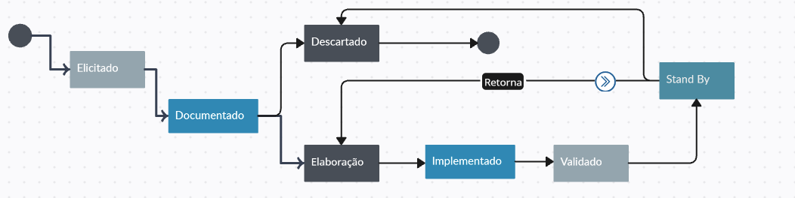

### Ciclo de Vida -  1) Defina um diagrama de estados que represente o ciclo de vida dos requisitos do seu projeto de acordo com os conceitos estudados na disciplina, fazendo sentido para a realidade do mesmo (usar a  Figura 6.1 do livro CPRE Foundation Level como inspiração mas não pode copiar). 

### 2) Ciclo de Vida - Defina o estado atual de cada requisito do seu projeto de estudo da disciplina de acordo com o que vc definiu no item 1 desta questão.
| Requisitos                         | Estado atual   |    
| -----                              | --------       |
| Autorizar voluntário na ação       | Stand By       |
| Voluntariar em uma ação            | Stand By       |
| Visualizar Ação                    | Stand By       |
| Buscar ações                       | Stand By       |
| Criar ação                         | Stand By       |
| Convidar responsável para uma ação | Stand By       |
| Remover responsável de uma ação    | Stand By       |
| Desvoluntariar de uma ação         | Stand By       |
| Remover voluntário de uma ação     | Stand By       |
| Avaliar voluntário                 | Descartado     |
| Avaliar ação                       | Stand By       |
| Gerenciar ação                     | Stand By       |
| Gerenciar usuário                  | Stand By       |
| Denunciar ação                     | Stand By       |
| Denunciar usuário                  | Descartado     |
| Criar conta                        | Stand By       |
| Notificar usuário                  | Descartado     |

### Atributos - Defina 6 atributos para os requisitos do seu sistema de trabalho na disciplina e crie uma tabela especificando esses atributos para os requisitos do seu sistema (obs: as linhas contém os requisitos e as colunas os atributos)
| Requisitos                         | Identificação   |  Prioridade |  Dificuldade  | Origem         |
| -----                              | --------        | ----------- | --------      | ------         |
| Autorizar voluntário na ação       | F01             | Alta        | 1.3           | PDSWeb         |
| Voluntariar em uma ação            | F02             | Alta        | 1.0           | PDSWeb         |
| Visualizar Ação                    | F03             | Alta        | 1.1           | PDSWeb         |
| Buscar ações                       | F04             | Media       | 1.0           | PDSDistribuido |
| Criar ação                         | F05             | Alta        | 2.0           | PDSWeb         |
| Convidar responsável para uma ação | F06             | Baixa       | 5.0           | PDSWeb         |
| Remover responsável de uma ação    | F07             | Baixa       | 5.0           | PDSWeb         |
| Desvoluntariar de uma ação         | F08             | Alta        | 1.0           | PDSWeb         |
| Remover voluntário de uma ação     | F09             | Media       | 1.0           | PDSWeb         |
| Avaliar voluntário                 | F10             | Baixa       | 5.0           | PDSWeb         |
| Avaliar ação                       | F11             | Baixa       | 1.0           | PDSWeb         |
| Gerenciar ação                     | F12             | Alta        | 1.2           | PDSWeb         |
| Gerenciar usuário                  | F13             | Media       | 1.0           | PDSWeb         |
| Denunciar ação                     | F14             | Baixa       | 3.0           | PDSCorporativo |
| Denunciar usuário                  | F15             | Baixa       | 3.0           | PDSCorporativo |
| Criar conta                        | F16             | Alta        | 2.0           | PDSWeb         |
| Notificar usuário                  | F17             | Baixissima  | 5.0           | PDSDistribuido |

### RASTREABILIDADE - Faça uma matriz de rastreabilidade, no formato tabela, que associe a as fontes de elicitação - usadas para levantar os requisitos do seu sistema - com cada requisito (usar como exemplo a Tabela 6.1 do livro do livro CPRE Foundation Level)

| Requisitos                         | Origem         | 
| -----                              | --------       | 
| Autorizar voluntário na ação       | PDSWeb         | 
| Voluntariar em uma ação            | PDSWeb         | 
| Visualizar Ação                    | PDSWeb         |
| Buscar ações                       | PDSDistribuido | 
| Criar ação                         | PDSWeb         |
| Convidar responsável para uma ação | PDSWeb         | 
| Remover responsável de uma ação    | PDSWeb         | 
| Desvoluntariar de uma ação         | PDSWeb         |
| Remover voluntário de uma ação     | PDSWeb         |
| Avaliar voluntário                 | PDSWeb         |
| Avaliar ação                       | PDSWeb         |
| Gerenciar ação                     | PDSWeb         |
| Gerenciar usuário                  | PDSWeb         |
| Denunciar ação                     | PDSCorporativo |
| Denunciar usuário                  | PDSCorporativo |
| Criar conta                        | PDSWeb         |
| Notificar usuário                  | PDSDistribuido |
