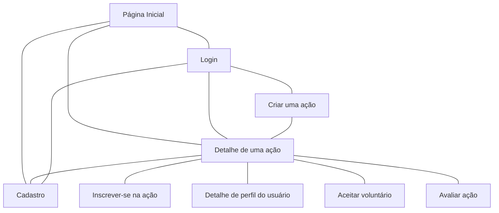

# Mapa do Site

Obs.: propõem-se a utilização de alguma ferramenta que possibilite a representação textual do diagrama. Como o Seguinte exemplo:

```mermaid
flowchart TD
    A[Página Inicial] --- B[Login]
    A[Página Inicial] --- C[Cadastro]
    C[Cadastro] --- B[Login]
    D --- C[Cadastro]
    A --- D[Detalhe de uma ação]
    B --- D[Detalhe de uma ação]
    E --- D[Detalhe de uma ação]
    B --- E[Criar uma ação]
    D --- F[Inscrever-se na ação]
    D --- G[Detalhe de perfil do usuário]
    D --- H[Aceitar voluntário]
    D --- I[Avaliar ação]
```
